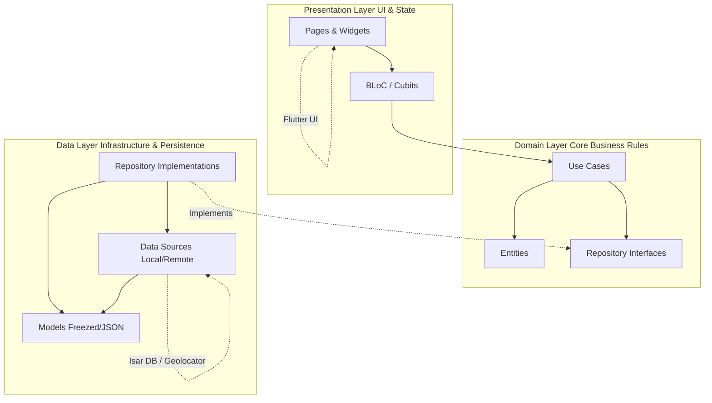

# Architectural Design Document (ARCHITECTURE.md)

This document describes the architectural patterns, clean architecture boundaries, and SOLID design principles governing the Reminders application codebase.

## 1. Architectural Philosophy
The Reminders application is built using a **Feature-First** layout adhering to **Clean Architecture** principles. The core goal is separation of concerns: separating business logic from frameworks, UI layers, databases, and device-specific services (like background location or audio playback).

### Benefits of this Architecture
* **Testability**: Business rules (use cases and entities) can be tested in isolation with simple unit tests without mocking Flutter components or complex platforms.
* **Maintainability**: Low coupling between modules ensures changes in one feature or layer (e.g., changing local storage from Isar to Hive) do not propagate across the codebase.
* **Scalability**: Multiple developers can work on distinct features simultaneously without merge conflicts or architectural drift.

---

## 2. Clean Architecture Layer Separation

Within each feature module, files are organized into three primary layers: **Domain**, **Data**, and **Presentation**.



### A. Domain Layer (Inward / Business Core)
The domain layer is the conceptual core of each feature. It must not import any packages or classes from the Presentation or Data layers, nor any external platform frameworks (like Flutter, Geolocator, or Audioplayers).
* **Entities**: Plain Dart objects representing core domain models. They should be immutable.
* **Use Cases**: Encapsulate unique business rules (e.g., `AddLocationReminder`, `TriggerReminder`). They act as the orchestration layer between presentation state and repository boundaries.
* **Repository Contracts (Interfaces)**: Define the data-access operations required by the domain. They dictate *what* data is needed, while leaving *how* it is fetched to the data layer.

### B. Data Layer (Outward / Infrastructure)
The data layer implements the interfaces defined in the domain layer and interacts with external frameworks, databases, and platform APIs.
* **Models**: Concrete representations of data structures returned by databases or APIs (e.g., Isar schemas, JSON schemas). Built using `Freezed` for immutability, data cloning, and generation of serialization methods.
* **Data Sources**: Perform actual raw data retrieval and storage operations. Local data sources write to the local database (Isar) or shared preferences; remote data sources communicate with REST endpoints (e.g., using `Dio`).
* **Repository Implementations**: Implement domain contracts, coordinate remote and local data source actions, and translate/map data layer models to domain-ready entities.

### C. Presentation Layer (Outward / User Interface)
The presentation layer handles displaying information to the user and capturing user interactions.
* **State Management**: Implemented using the **BLoC (Business Logic Component)** pattern (`flutter_bloc` package). BLoCs consume UI events, coordinate with domain Use Cases, and emit immutable UI states.
* **Pages & Widgets**: Standard Flutter widgets. They are declarative, passive, and rebuild themselves by listening to BLoC states (`BlocBuilder`, `BlocConsumer`).
* **Navigation**: Declared outside pages using `go_router` to support deep linking and decoupling of screen routing from widget trees.

---

## 3. Dependency Flow & Dependency Inversion

To keep the Domain layer clean of infrastructure dependencies, the **Dependency Inversion Principle (DIP)** is strictly followed:
1. The **Domain** defines the repository interface.
2. The **Data** layer implements that interface.
3. The **Presentation** layer interacts with the repository *only* through its interface.
4. During application startup, a Dependency Injection container (`get_it` and `injectable`) registers and binds the concrete Data implementation to the abstract Domain contract.

```
Startup (main.dart) ──> configureDependencies() ──> Injectable binds RepoImpl to RepoContract
Use Case ─────────────> depend on RepoContract (GetIt injects RepoImpl instance)
```

---

## 4. SOLID Design Principles Integration

* **Single Responsibility Principle (SRP)**:
  Each class has one reason to change. Widgets only paint UI; BLoCs only map events to states; Use Cases perform exactly one business task (e.g., `GetLocationRemindersUseCase`); Repositories handle data synchronization; Data Sources interact with the database engine.
* **Open/Closed Principle (OCP)**:
  Components are designed for extension rather than modification. For example, rather than changing existing theme files when updating styles, customized configurations can be extended using `ThemeExtension` subclasses (`AppColors`, `AppGradients`, `AppTypography`).
* **Liskov Substitution Principle (LSP)**:
  All repository implementations subclassing a domain contract can be substituted seamlessly. For instance, testing a Use Case only requires supplying a Mock/Fake Repository class that conforms to the interface, assuring identical behavior.
* **Interface Segregation Principle (ISP)**:
  Instead of compiling all application services under a single massive service API, repository contracts are split by feature boundaries. Classes do not implement large interfaces containing methods they do not use.
* **Dependency Inversion Principle (DIP)**:
  Use Cases and State Managers depend on interface abstractions, not database engines or location sensors. Implementation details are pushed to the outer boundary of the architecture.

---

## 5. Architectural Implementation Details

### Dependency Injection with GetIt & Injectable
* Configured in `lib/core/di/`.
* `@module` annotation in `register_module.dart` resolves third-party packages (like `Isar`, `FlutterLocalNotificationsPlugin`, and `AudioPlayer`) so they can be injected easily.
* Uses code generation via `build_runner` to produce compile-time type-safe injections.

### Persistence Strategy (Isar)
* Local caching is handled by `Isar` database instances.
* Configured as an asynchronous, non-blocking service pre-resolved during app initialization.
* Entities are separated from Isar schemas to prevent database details from bleeding into the domain logic.

### Background Services and Platform APIs
* Geolocator and background tasks (`flutter_background_service`) execute in isolated contexts.
* The background service communicates updates to the application through notifications or shared storage coordinates.
* Device integrations (Audio playback, notifications) are abstracted behind service wrapper contracts.
