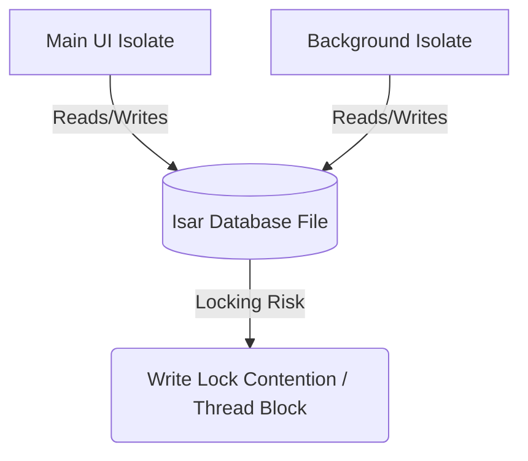

# Project Concerns & Risks

This document highlights critical risks, architectural limitations, platform-specific constraints, and dependency vulnerabilities identified during the codebase analysis of the **Location Reminders** application.

---

## 1. Platform-Specific Background & Permission Risks

Because this application relies on real-time background location tracking (`geolocator`, `flutter_background_service`) and user alerts (`flutter_local_notifications`), it is subject to strict OS-level background execution constraints and sandbox policies.

### A. iOS Background Location Constraints & App Store Rejections
*   **Always Allow Requirement**: For the application to check the user's location when the app is terminated or in the background, the user must grant **"Always Allow"** location access. However, iOS initially prompts only for "While In Use". The app must explicitly guide the user to upgrade permissions in System Settings, which is a friction point.
*   **App Store Review Guideline 2.5.4**: Apple heavily scrutinizes applications requesting background location permissions. If the app cannot demonstrate a clear, user-facing need for continuous background tracking, it will be rejected.
*   **Info.plist Missing Declarations**: The current `Info.plist` lacks the mandatory privacy keys. To prevent immediate app store rejection or crashes, the following keys must be added:
    *   `NSLocationAlwaysAndWhenInUseUsageDescription`
    *   `NSLocationWhenInUseUsageDescription`
    *   `UIBackgroundModes` containing `location` and `fetch`.
*   **Sudden OS Revocation**: iOS dynamically prompts users after a few days of background usage, showing a map of location points tracked and asking if they want to downgrade permission to "Only While Using". If downgraded, the background isolate will fail silently.

### B. Android Foreground Service & Permission Scrutiny
*   **Android 14 (API 34) Foreground Service Type**: Android 14 introduces mandatory declarations for foreground services. The background service must explicitly declare its type in `AndroidManifest.xml` as `location`.
    ```xml
    <service
        android:name="com.jected.flutter_background_service.BackgroundService"
        android:foregroundServiceType="location"
        android:exported="false" />
    ```
*   **ACCESS_BACKGROUND_LOCATION Permission**: Android 10+ requires runtime request of background location. Google Play requires a dedicated privacy declaration and a prominent in-app disclosure video before approving apps with this permission.
*   **OEM Battery Optimizations**: Handsets from manufacturers like Samsung, Xiaomi, and OnePlus deploy aggressive battery savers (e.g., "Put unused apps to sleep"). These will terminate the background location service within minutes unless the user manually whitelist the app from battery optimizations.

### C. Battery Drain & Location Tracking Frequency
*   **Continuous GPS Exhaustion**: Keeping the GPS chip active in high-accuracy mode (`LocationAccuracy.high` or `LocationAccuracy.best`) drains a device's battery from 100% to 0% in 3–5 hours.
*   **Lack of Adaptive Tracking**: Currently, there is no adaptive tracking mechanism in place. The tracking algorithm should dynamically adjust its query frequency:
    *   **Coarse Tracking**: Use low accuracy and long distances when the user is far from any active reminder (e.g., using cell-tower/Wi-Fi positioning, `LocationAccuracy.low`).
    *   **Fine Tracking**: Increase accuracy (`LocationAccuracy.high`) only when the user is within a close geofence threshold (e.g., < 500 meters) of a registered reminder.

---

## 2. Hardware & Resource Integration Concerns

### A. Audio Playback Constraints (`audioplayers`)
*   **Silent Mode / Do Not Disturb Override**: On iOS, if the hardware silent switch is toggled, standard audio playback is muted. To ensure reminder alarms ring regardless of physical switch states, the audio session category must be set to `playback` using native configuration (or the `audio_session` package).
*   **Isolate Audio Execution**: The background service running in a separate Dart isolate must play the audio. However, native audio players sometimes fail to initialize properly from non-main isolates on iOS/Android because of window context bindings or audio session hooks.
*   **Resource Leaks**: The `AudioPlayer` registered in GetIt (`RegisterModule.audioPlayer`) is a singleton. If multiple reminders trigger concurrently, calling `.play()` on the same instance will interrupt the current alarm, or crash. There is also a risk of memory leaks if instances are created dynamically and not disposed of via `.dispose()`.

### B. Notification Delivery Reliability (`flutter_local_notifications`)
*   **Android 13+ (API 33) Runtime Permissions**: Apps can no longer show notifications without explicit runtime consent. If the user denies `POST_NOTIFICATIONS`, reminders will trigger silently in the background, rendering the app ineffective.
*   **Background Notification Channel Pinning**: The background service must be tied to a persistent notification channel. If the user disables this channel in settings, the OS will deprioritize and kill the background service.

---

## 3. Data Persistence & Concurrency Risks

The application uses **Isar** as its local database. This introduces structural risks related to multi-isolate access and code generation.



### A. Isolate Concurrency & Multi-Instance File Locking
*   **Dart Isolate Isolation**: Dart isolates do not share memory. The background location tracking service runs in its own isolate and cannot share the database instance initialized by the UI thread.
*   **Database Locks**: While Isar supports opening the same database file from multiple isolates, concurrent write transactions can block each other. If the background isolate is performing a write (e.g., logging location history or updating reminder state) at the exact millisecond the user is editing a reminder in the UI, it can lead to write transaction timeouts or app locks.
*   **Pre-Resolve Failure**: The Isar initialization is marked with `@preResolve` in `RegisterModule`. If opening the database in the background isolate blocks due to a lock held by the UI thread, it could block the background service's startup entirely.

### B. Schema Safety & Code Generation
*   **Stale Generator Output**: Isar requires code generation via `build_runner`. If schema changes are made in the entities (e.g., adding an option to `Reminder`) and the developer fails to run the code generator, the generated `injection.config.dart` and Isar schemas will drift, causing runtime crashes during dependency resolution or database queries.
*   **Migration Failure**: Modifying schema columns without defining proper migration plans or using safe schema properties will corrupt existing user database files upon app updates, causing the app to crash on launch.

---

## 4. Dependency & Build Pipeline Risks

### A. Stale SDK Environment
*   **Dart/Flutter version (SDK ^3.10.4)**: The workspace is locked to Dart SDK 3.10.4 (released mid-2023). This is outdated, lacking access to modern compiler optimizations, Swift Package Manager (SPM) integrations, and modern Dart language features (such as macros or enhanced pattern matching).

### B. Fragile Dependency Overrides
*   The `pubspec.yaml` contains severe dependency overrides:
    ```yaml
    dependency_overrides:
      analyzer: 5.12.0
      dart_style: 2.3.2
      build_resolvers: 2.2.0
    ```
    *   **Root Cause**: These overrides indicate version mismatches between older generators (`freezed`, `isar_generator`, `injectable_generator`) and the current Dart analyzer version.
    *   **Risk**: Updating any minor dependency in the future is likely to break the build pipeline. This structure acts as a barrier to standard upgrading and security patching.

### C. Isar DB Maintenance Status
*   **Project Abandonment**: Isar 3.x is highly stable but has transitioned out of active maintenance by its creator (who shifted focus). Isar 4.0 has been in beta/alpha status for a long time. 
*   **Future Incompatibility**: As Flutter updates its FFI and internal structures, Isar 3.x is prone to compilation failures. The development team should evaluate migrations to `drift` (SQLite) or `hive` (for simpler key-value storage) if long-term upgrade compatibility is required.

---

## 5. Architectural Concerns

### A. State Synchronization Between Isolates
*   If the user adds, updates, or deletes a reminder in the UI, the background service remains unaware of this change unless:
    1.  It queries the Isar database continuously (inefficient database polling).
    2.  An Isar watcher/stream (`isar.reminders.watchLazy()`) is successfully active in the background isolate.
    3.  The UI explicitly notifies the background service via IPC port signals (`FlutterBackgroundService().invoke(...)`).
*   Failing to synchronize these states properly will cause geofence triggers to fire for deleted reminders, or not fire for newly created ones.

---

## Actionable Mitigation Checklist

| Risk Area | Specific Threat | Recommended Mitigation |
| :--- | :--- | :--- |
| **Permissions** | iOS / Android Location access denial or downgrades. | Implement a dedicated onboarding flow that explains *why* background permission is required before presenting the OS system dialog. Check permission states on app resume. |
| **Manifests** | App Store rejection or Android background service crashes. | Add `NSLocationAlwaysAndWhenInUseUsageDescription` to `Info.plist`. Add `foregroundServiceType="location"` to Android service declarations. |
| **Battery Life** | Continuous GPS activation causing fast battery drain. | Build an adaptive tracking loop that scales location query interval and accuracy based on the distance to the nearest target reminder. |
| **Audio** | Silent alarms on muted/DND devices. | Configure native iOS Audio Session category to `playback` using `audio_session` package. |
| **Isolate DB** | Write lock contentions and Isar database crashes. | Coordinate database writes. Ensure both isolates open Isar with the exact same schemas and name. Limit background isolate writes to minor status flags. |
| **Dependencies** | Code generator conflicts and fragile overrides. | Schedule a migration step to upgrade the SDK to the latest Flutter stable release and upgrade all dev_dependencies to eliminate the `dependency_overrides` hacks. |
| **State Sync** | Stale reminder data cached in background isolate. | Use `Isar` reactive queries (watchers) or `flutter_background_service` custom action listeners to hot-reload target reminders in the background loop when the DB updates. |
